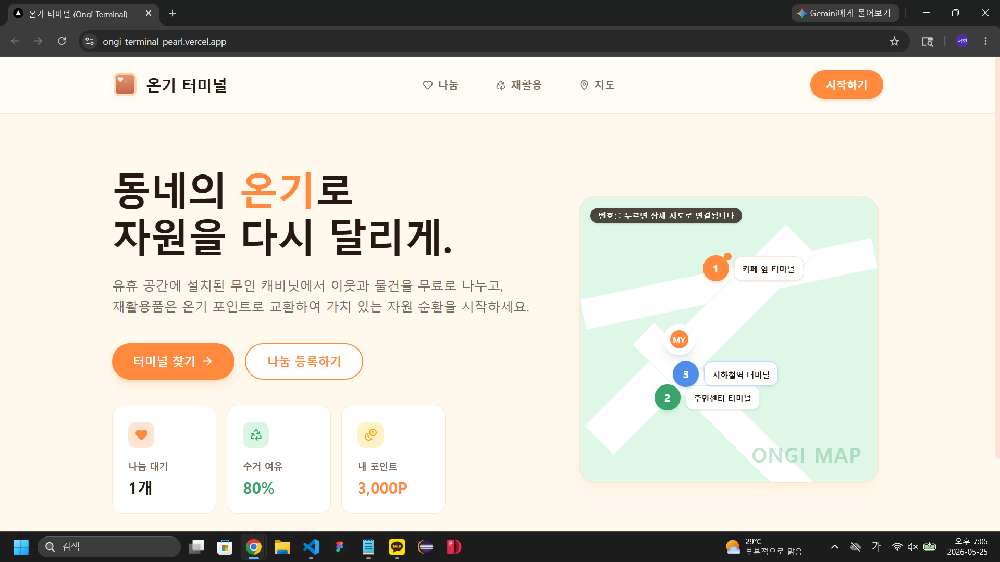
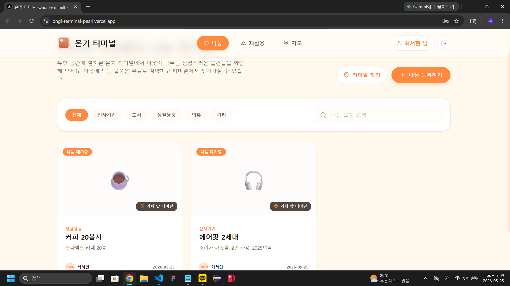
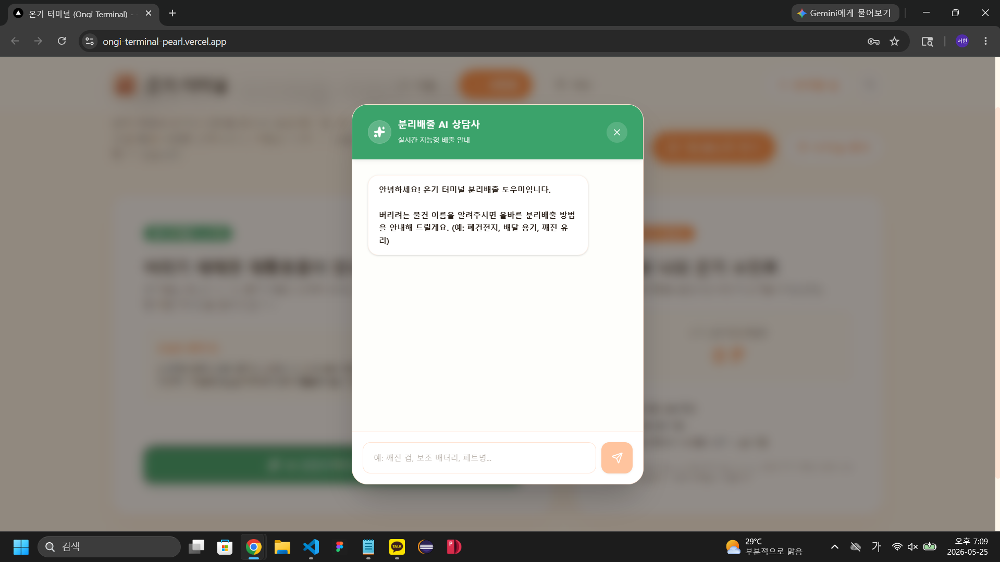
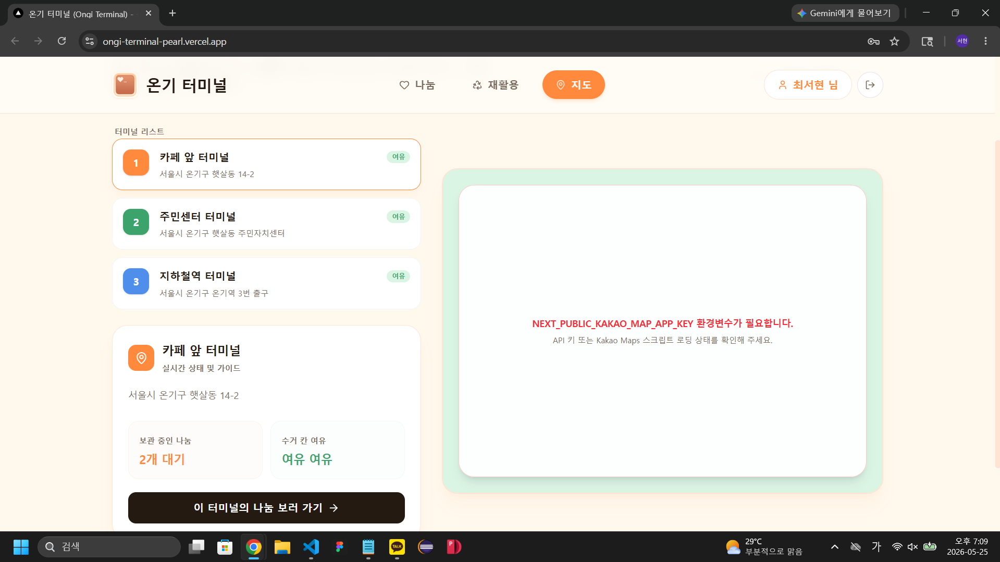
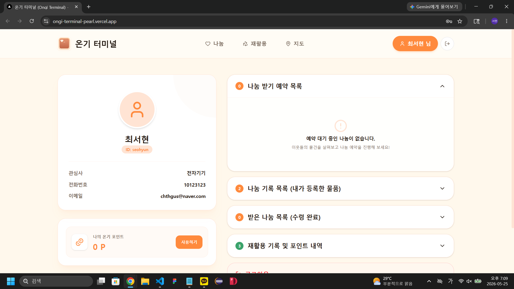

<div align="center">

# 🔥 온기 터미널 (Ongi Terminal)

### *"버리기 전에, 동네 안에서 다시 순환되도록"*

[](https://ongi-terminal-pearl.vercel.app)
[](https://ongi-terminal-pearl.vercel.app)
[](https://ongi-terminal-pearl.vercel.app)

<br/>

> AI 기반 개인화 추천과 비대면 공유 거점을 결합해,  
> 버려질 물건의 재사용과 재활용을 돕는 **지역 자원 순환 플랫폼**

<br/>

---

## 📸 스크린샷

| | | | | |
|:---:|:---:|:---:|:---:|:---:|
|  |  |  |  |  |
| 홈 화면 | 나눔 목록 | 재활용 AI | 지도 | 마이페이지 |

---

</div>

## 🚀 서비스 소개

**온기 터미널**은 동네 기반 비대면 공유 시스템과 AI 추천 기능을 결합한 지역 자원 순환 플랫폼입니다.

- 🏪 **비대면 무상 공유** — QR 코드 기반으로 채팅·약속 없이 물건을 나누고 받아요
- 🤖 **AI 순환 추천** — 관심사 기반으로 주변 터미널 물품을 개인화 추천해요
- ♻️ **재활용 코칭** — AI가 올바른 분리배출 방법을 안내하고 포인트를 적립해요
- 🌱 **온기 포인트** — 나눔·재활용 활동으로 포인트를 모아 친환경 굿즈로 교환해요

<br/>

## 🛠 기술 스택

### Frontend


### Backend


### AI


### Deploy


<br/>

## 🌐 배포 주소

| 서비스 | URL |
|--------|-----|
| 🖥️ **프론트엔드** | https://ongi-terminal-pearl.vercel.app |
| ⚙️ **백엔드 API** | https://ongi-terminal-production-9b74.up.railway.app |
| 📖 **API 문서** | https://ongi-terminal-production-9b74.up.railway.app/docs |

## 피그마, PPT
| 📄 **기획서** | [PDF 보기](./ongi-terminal/ongiTerminalPDF.pdf) |
| 🎨 **Figma** | [디자인 보기](https://www.figma.com/design/QVf1NAqRt5W0UNq2UVER18/%EC%98%A8%EA%B8%B0-%ED%84%B0%EB%AF%B8%EB%84%90-%EB%94%94%EC%9E%90%EC%9D%B8?node-id=0-1&p=f&t=sMlrc4aGfEsV2RZx-0) |
<br/>

## 👨‍💻 팀 구성 및 역할

| 이름 | 역할 |
|------|------|
| 최서현 | 백엔드 개발 · API 연동 · 서버 배포 |
| 안윤건 | 프론트엔드 개발 · API 연동 · AI · 지도 |
| 우희찬 | 기획 · 디자인 · 문서 · PPT · 발표 |

<br/>

## ⚙️ 로컬 실행 방법

### 프론트엔드
```bash
cd ongi-terminal
npm install
npm run dev
# http://localhost:3000
```

### 백엔드
```bash
cd ongi-terminal-BE
docker-compose down -v
docker-compose build --no-cache
docker-compose up -d
docker exec ongi-terminal-be-api-1 alembic upgrade head
```

<br/>

## 📁 프로젝트 구조

```
Ongi-Terminal/
├── ongi-terminal/          # 프론트엔드 (Next.js)
│   └── app/
│       ├── components/     # UI 컴포넌트
│       └── page.tsx        # 메인 페이지
└── ongi-terminal-BE/       # 백엔드 (FastAPI)
    └── app/
        ├── routers/        # API 라우터
        ├── models/         # DB 모델
        ├── schemas/        # Pydantic 스키마
        └── services/       # 비즈니스 로직
```

<br/>

---

<div align="center">

**2026 DUYUTHON · 17조 · 온기 터미널**

*동네의 온기로, 자원을 다시 달리게.*

</div>
